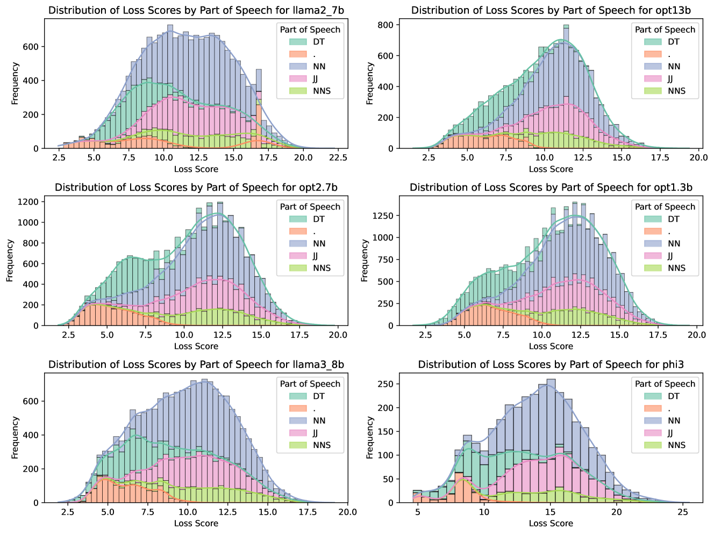
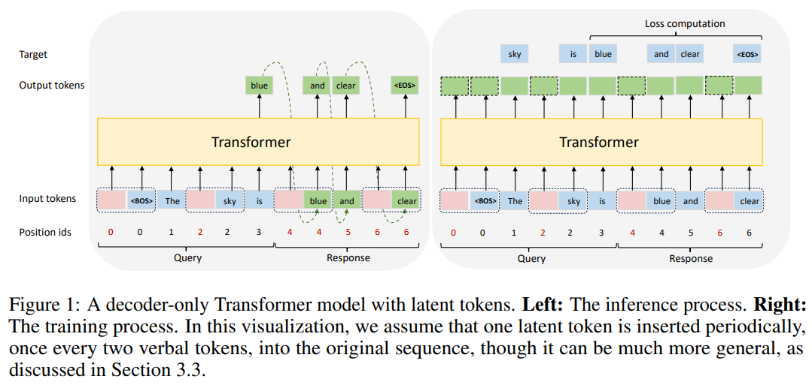

# repurposed-tokens-experiment
What hidden role do low entropy, easy-to-predict tokens (such as punctuation) play in a transformer?

Core questions:
1) Can we find the model attending to punctuation at abnormal rates during challenging computation?
2) Does a model perform better when fine-tuned to interject punctuation between math calculations, than it does with 


## Motivation
This is an interpretability project.  While there are easy speculations on ways this work can inform new architectures or prompts, the primary goal is to understand how LLMs use superposition and context memory in tokens that are often ignored.


## Existing work
Not much has been researched on this topic that I have been able to find.  There are at least two relevant papers, and both are extremely relevant.

**Paper 1:** Uncovering the Hidden Role of Punctuation in Context Memory of Transformers  
[arXiv:2502.15007](https://arxiv.org/abs/2502.15007)  
It establishes that removing punctuation, a low-entropy token I'm interested in, hurts MMLU and long-context QA.  They trained a reconstruction model to predict the text leading up to a token using only a summary of the main model's hidden states for that token.  When given the model's hidden states for punctuation, the reconstruction model is able to do really well at guessing the previous tokens.  I plan on directly using some of the visualization code to plot contextualization and non-linearity.

This paper shows very low reconstruction loss for punctuation (.) compared to something like nouns (NN).  


**Paper 2:** Enhancing Latent Computation in Transformers with Latent Tokens  
[arXiv:2505.12629](https://arxiv.org/abs/2505.12629)  
The second paper is extremely similar to what I want to do, but has none of the interpretability framing.  They introduce new tokens, termed "latent tokens", and fine-tune the model to use these tokens intermittently in the output.  Doing so appears to give the model a better scratchpad to maintain better long-term performance.  



## Environment Setup
- Python: 3.10
- CUDA driver: 12.x (tested with NVIDIA driver version 555.42)
- PyTorch: 2.5.1+cu121
- Model: Meta-Llama-3-3B-Instruct

```yaml
conda env create -f "environment.yml" --name repurposed-tokens
conda activate repurposed-tokens
```


## License and Citation
Code is released under the Apache-2.0 license. Any use of model weights should follow their original license terms.

#### Referenced Papers
- Diao, S., Gu, Y., Cai, T., Ma, X., & Neubig, G. (2025). *Uncovering the Hidden Role of Punctuation in Context Memory of Transformers*. arXiv:2502.15007. [https://arxiv.org/abs/2502.15007](https://arxiv.org/abs/2502.15007)
- Chen, Y., Zhang, Y., Liu, H., Zhou, C., Ma, X., & Neubig, G. (2025). *Token Deletion Improves In-Context Learning via Multi-Step Reasoning*. arXiv:2505.12629. [https://arxiv.org/abs/2505.12629](https://arxiv.org/abs/2505.12629)
