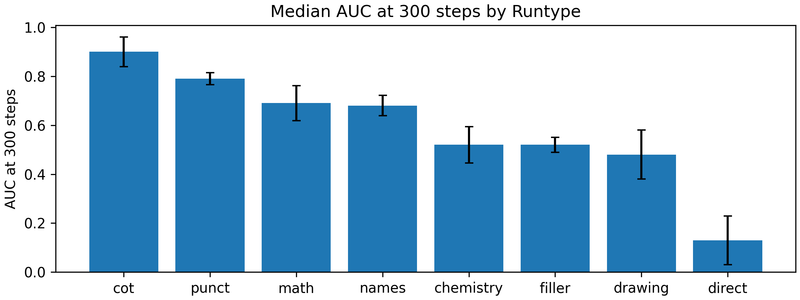
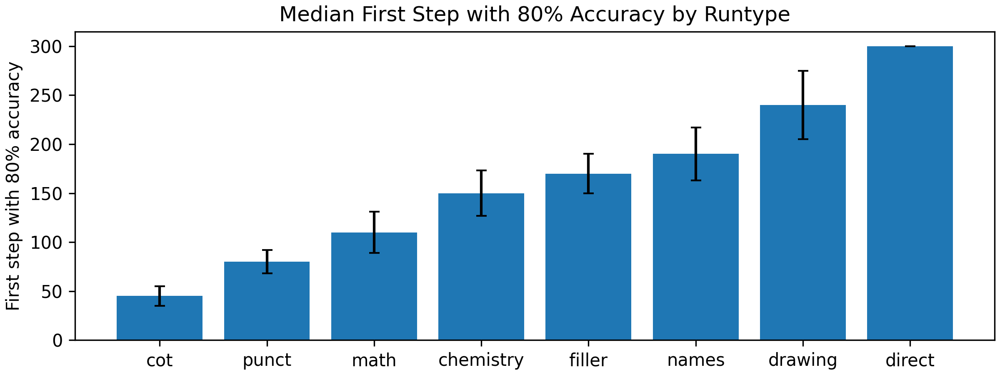
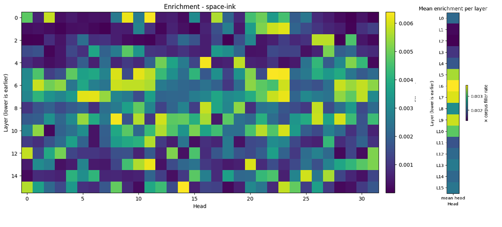
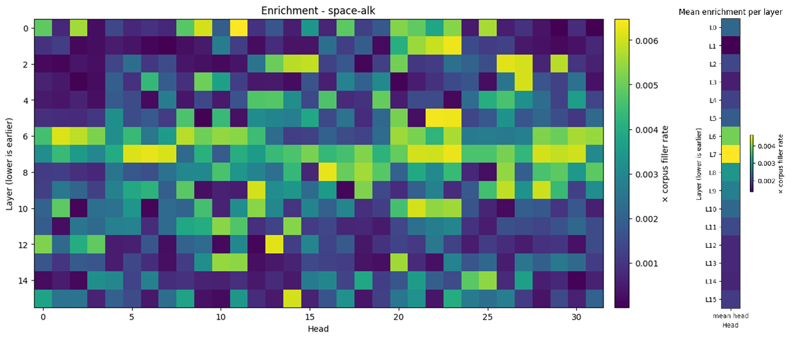
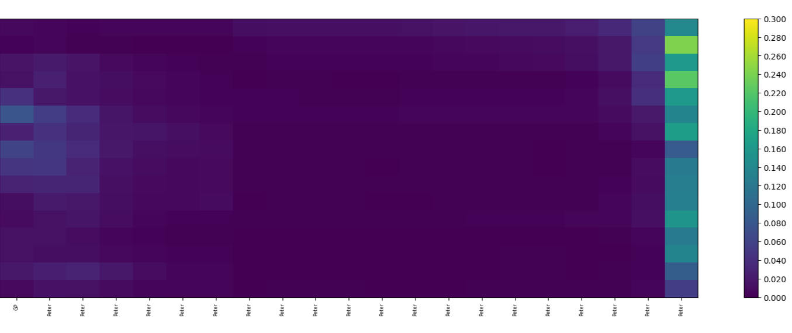
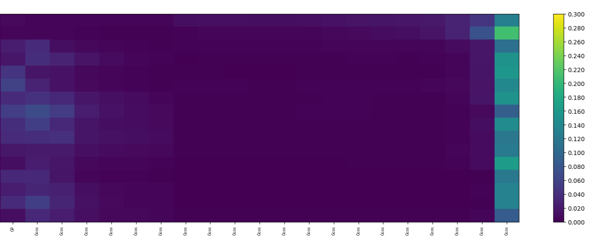

# repurposed-tokens-experiment
What hidden role do low entropy, easy-to-predict tokens (such as punctuation) play in a transformer?  Are models able to utilize easy-to-predict tokens in any way not directly related to their meaning or context in a sentence?  We hypothesize that when a token's surface meaning is trivial or highly predictable, the model can more easily repurpose the extra representational capacity in that token's embedding for latent computation.

Core questions to test:
1) Can we find the model attending to easy tokens at abnormal rates during computation?
2) Does a model fine-tune faster when using easy tokens as filler than with hard?

## Motivation
This is an interpretability project.  While there are easy speculations on ways this work can inform new architectures or prompts, the only goal is to better understand how LLMs use superposition and context memory in tokens.

## Existing work
There is not an extensive pool of research on this topic, but what I can find is highly relevant.  These are papers that inspire my methodology:

**Paper 1:** Uncovering the Hidden Role of Punctuation in Context Memory of Transformers  
[arXiv:2502.15007](https://arxiv.org/abs/2502.15007)  
It establishes that removing punctuation, a low-entropy token I'm interested in, hurts MMLU and long-context QA.  They trained a reconstruction model to predict the text leading up to a token using only a summary of the main model's hidden states for that token.  When given the model's hidden states for punctuation, the reconstruction model is able to do really well at guessing the previous tokens.  I plan on directly using some of the visualization code to plot contextualization and non-linearity.

This paper shows very low reconstruction loss for punctuation (.) compared to something like nouns (NN).  

**Paper 2:** Enhancing Latent Computation in Transformers with Latent Tokens  
[arXiv:2505.12629](https://arxiv.org/abs/2505.12629)  
The second paper is extremely similar to what I want to do, but has none of the interpretability framing.  They introduce new tokens, termed "latent tokens", and fine-tune the model to use these tokens intermittently in the output.  Doing so appears to give the model a better scratchpad to maintain better long-term performance.  

**Paper 3:** Causal Mediation Analysis of Arithmetic Reasoning  
[EMNLP 2023](https://aclanthology.org/2023.emnlp-main.435.pdf)
By swapping MLP/A blocks of two different math equation prompts, they identify which parts of the model actually cause a change in output.  Because swapping the final block is trivial, they report the **earliest** layer whose swap reliably flips the answer.

## Experiment Outline
We take five words from each category (punctuation, chemistry, names, math, drawing, and extremely rare tokens) and run three mlp-only LoRa finetunes for each.  To get smoother and more discernable results, training speed was limited to a learning rate of 3e-4, though a much faster one can be used to train in 20-30 steps.  We use a mlp-only LoRa to preserve the pretrained attention routing while allowing token-specific feature adaptation in the feed-forward pathway.  Tokens were distance-matched across categories by corpus frequency and normalized embeddings due to higher frequency and higher norm tokens finetuning faster by default.

## Results
Results show curves that follow the hypothesis.  By finetuning with a MLP-only LoRa, we find the higher entropy the token, the longer it takes for it to utilize its attention.  We can see the two baselines of CoT and direct making up the fastest and slowest training curves, respectively.  In between them, the punctuation tokens provide the quickest path.  This first graph shows the median AUC for each runtype, which represents how much of the training got done within 300 steps.  The second graph shows the median first step to achieve 80% accuracy on the test set per runtype.

As stated previously, the goal of this experiment is not to understand the reasoning behind these results.  As such we do not claim any causal patterns here, but we do provide two observations.  In looking at the attention patterns, we do notice the faster-training filler words tend to have sharper enrichment distributions, with most of the enrichment happening on only one or two layers.

The graph of layer vs token position (trimmed to problem question end onwards) are all extremely similar on every run.

## Reproduction
Environment setup and all code are currently standalone in Google Colab, across two files.  Data was generated in datagen.ipynb and experimentation was performed in experimentation.ipynb.

## License
Code is released under the Apache-2.0 license. Any use of model weights should follow their original license terms.

## Citation
- Diao, S., Gu, Y., Cai, T., Ma, X., & Neubig, G. (2025). *Uncovering the Hidden Role of Punctuation in Context Memory of Transformers*. arXiv:2502.15007. [https://arxiv.org/abs/2502.15007](https://arxiv.org/abs/2502.15007)
- Chen, Y., Zhang, Y., Liu, H., Zhou, C., Ma, X., & Neubig, G. (2025). *Token Deletion Improves In-Context Learning via Multi-Step Reasoning*. arXiv:2505.12629. [https://arxiv.org/abs/2505.12629](https://arxiv.org/abs/2505.12629)
